# netpoll-benchmark

**置顶声明:**

本 [RPC 场景测试](#测试设定) 项目中，部分包含面向 [Redis 场景][redis] 的 [evio][evio], [gnet][gnet] 测试数据，不构成参考建议。

## 什么是 RPC 场景

这里所说的 [RPC 场景](#什么是-RPC-场景)，是为了区别于 [Redis 场景][redis]，特点是处理逻辑(Handler)耗时较长。

以 Server 为例，一次服务调用过程可描述为：

*接收数据(Read Buffer) -> 解析请求(Decode) -> 逻辑处理(Handler) -> 响应编码(Encode) -> 发送数据(Write Buffer)*

如果上述过程处理速度很快(特别是 Handler), 则可以通过线程内串行处理的方式, 减少上下文切换，达到性能上的理论最优。 cache/proxy/纯计算类业务均属于这种情况，典型的如 [nginx][nginx]
, [redis][redis] 等。 由于没有专门的术语描述，以下我们将其称为 [Redis 场景][redis]。

而 RPC 业务特征是 Handler 逻辑较重，耗时较长，显然是不能串行处理的。 因此 [RPC 场景](#什么是-RPC-场景)，Handler 必须要异步处理，上下文切换、I/O 协作等都是必须考虑的代价。

## Netpoll 解决什么问题

### 1. 过多长连接下的问题：

线上微服务场景中，由于上下游实例众多，上下游之间的连接数是 k(M x N) 的关系，导致 client/server 均持有大量长连接。 而由于数据分发的负载均衡，长连接的工作总是间歇式的，即存在一定比例的空闲连接，以下描述为"空闲率"。

当我们使用 [go net][net] 编写 server 端代码时，必然的为每个连接都分配了一个独立的 goroutine，理想情况下，协程空闲率 = 连接空闲率; 而在 [netpoll][netpoll] 中，空闲连接是不持有 goroutine 的，只有正在工作的连接会在协程池中处理，这就尽可能的减少了协程数量，提高协程利用率。

我们构建了 [测试场景 2](#测试场景-2) 来评估空闲连接的代价。

### 2. 连接多路复用下的问题：

连接多路复用(以下简称 mux)是指在一条长连接上，合并「发送/接收」多个「请求/响应」。这种模式也是长连接利用率低下的一种解决方式。

mux 性能瓶颈主要在 合并包/拆分包，这里涉及到「并行转队列」和「队列转并行」的具体实现。 

常见的基于 [go net][net] 编写的框架，会采用 `go readloop(conn)` && `go writeloop(conn)` 方式，构建两个协程，`循环式(串行)的完成编解码`，这在 [go net][net] 下确实是最优的。

但是 [netpoll][netpoll] 有更优的实现，提供的 nocopy API 可以将编解码转为异步。为此，我们构建了 [测试场景 3](#测试场景-3) 来评估收益。

#### PS: [netpoll][netpoll] 为什么不采用 `串行编解码` ？
A: 这里需要明确指出 `串行编解码` 适用场景更有限，在 LT(水平触发) 下，`串行编解码` 意味着需要快速判断包大小。然而并不是所有 RPC 协议都有头部来表明长度，比如 HTTP、Thrift Buffered 等，这些协议下，转异步编解码是效率更好的方式。

## 测试设定

我们认可 [brpc][brpc] 的测试观点，上下文切换是 [RPC 场景](#什么是-RPC-场景) 必须付出的代价，每个线程独立循环地收发数据，对真实场景缺乏指导意义。 我们希望 benchmark
可以指导后续的优化工作，为了更切合 [RPC 场景](#什么是-RPC-场景) 测试，引入了以下设定：

1. 不能串行处理
    * 上述我们说明了 [RPC 场景](#什么是-RPC-场景) 和 [Redis 场景][redis]的区别，因此 Handler 必须异步执行。
    * `time.Sleep` 虽然能够规避串行处理，但 `timer` 唤醒拥有更高的调度优先级，干扰了 `runtime` 的正常调度，因此没有使用。
2. 不能边收边发
    * [RPC 场景](#什么是-RPC-场景)，必须要接收到完整的数据包，才可以继续处理，不能接收到一半就开始回包。
    * [evio][evio], [gnet][gnet] 欠缺异步处理机制(异步关闭、资源清理等)，因此我们做了近似处理，**不构成参考建议**。
3. 接收和发送的数据不能是同一份
    * [RPC 场景](#什么是-RPC-场景) 下的请求和响应，是通过序列化/反序列化产生的两份不同的数据。
    * 如果直接把读数据 buffer 直接写回，则忽略了这部分开销，并忽略了在这方面所做的一些优化。

## 开始测试

`Echo 测试` 将收到的 string 数据原样返回，定义了 `Message` 来模拟编解码过程。

协议格式为 `header(4 Byte)(=payload length), payload(n Byte)`。

[RPC 场景](#什么是-RPC-场景) 在 Client 和 Server 端使用方式不同，因此分别测试两端的性能表现。

* Client 测试：不同的 client，调用相同的 net server，评估 client 端性能表现。
* Server 测试：相同的 net client，调用不同的 server，评估 server 端性能表现

### 测试场景 1

`测试场景 1` 模拟「长连接池模式」下的 `Echo 测试`，用来评估连接池场景的性能上限。

* 连接池容量 = 1024

### 测试场景 2

`测试场景 2` 模拟「带空闲连接」下的 `Echo 测试`，用来评估空闲连接对性能的影响。

* 连接空闲率 = 80%

### 测试场景 3

`测试场景 3` 模拟「连接多路复用模式」下的 `Echo 测试`，用来评估拆包/组包的实际效率。

* 连接个数 = 4

### 快速执行：loopback 模式

以上测试场景，通过执行「脚本 + 场景号」，可以快速开始测试。执行前请先确认满足[环境要求](#环境要求)。

* client 测试

```bash
./scripts/benchmark_client.sh 1 # or 2, 3
```

* server 测试

```bash
./scripts/benchmark_server.sh 1 # or 2, 3
```

### 环境要求

OS: Linux

* 默认依赖了命令 `taskset`, 限定 client 和 server 运行的 CPU; 如在其他系统执行, 请修改脚本。

CPU: 推荐配置 >=20核, 最低要求 >=4核

* 压测脚本默认需要 20核 CPU, 具体在脚本的 `taskset -c ...` 部分, 可以修改或删除。

软件依赖: Python3 + matplotlib 用于绘图

* 在运行压测前， 可以使用 pip3 install matplotlib 安装依赖


## 参考数据 (echo size 1KB)

相关说明:

该压测数据是在调用端有充分机器资源**压满服务端**的情况下测试，更侧重于关注服务端性能。后续会提供调用端性能数据情况。

### 配置

* CPU:    Intel(R) Xeon(R) CPU E5-2630 v4 @ 2.20GHz
   * 运行限定 server 4CPU, client 16CPU
* OS:     Debian 6.4.7-amd64 x86_64 GNU/Linux
* Go:     go1.21.4

### [测试场景 1](#测试场景-1)

|             | QPS                                   | TP99                                   | TP999                                   |
| :---------- | :------------------------------------ | :------------------------------------: | :-------------------------------------: |
| Server(4C)  |  |  |  |
| Client(16C) | 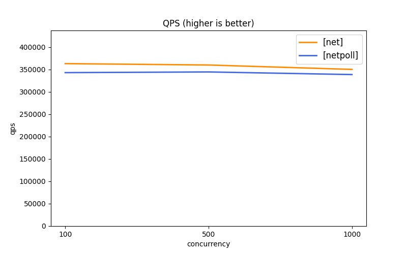 | 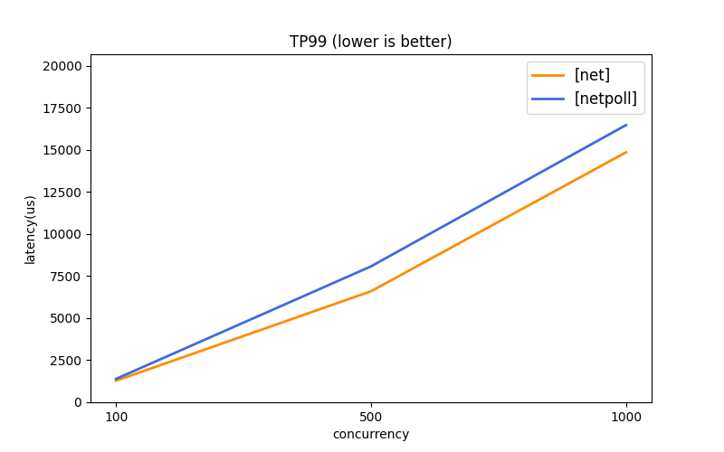 |  |

### [测试场景 2](#测试场景-2)

|             | QPS                                   | TP99                                   | TP999                                   |
| :---------- | :------------------------------------ | :------------------------------------: | :-------------------------------------: |
| Server(4C)  | 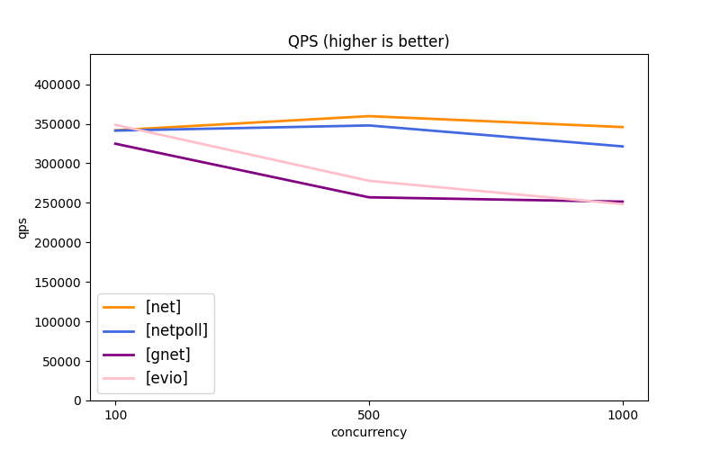 | 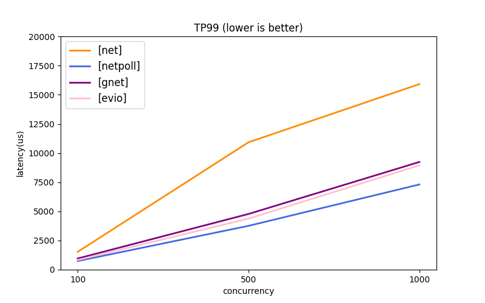 | 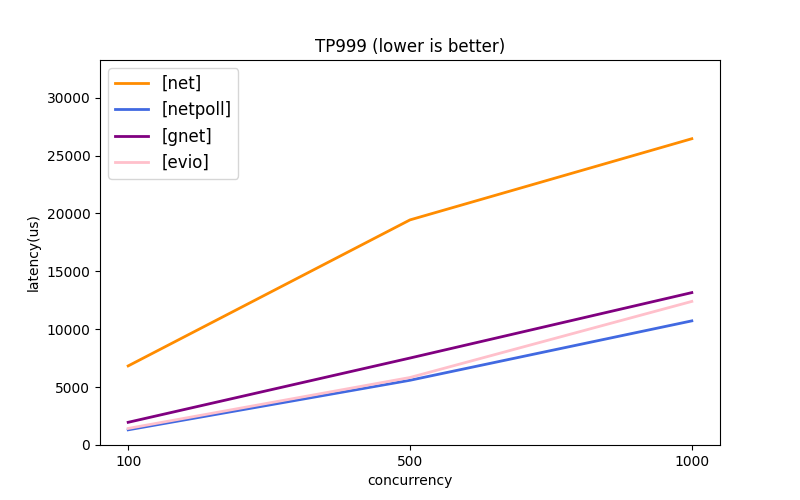 |
| Client(16C) | 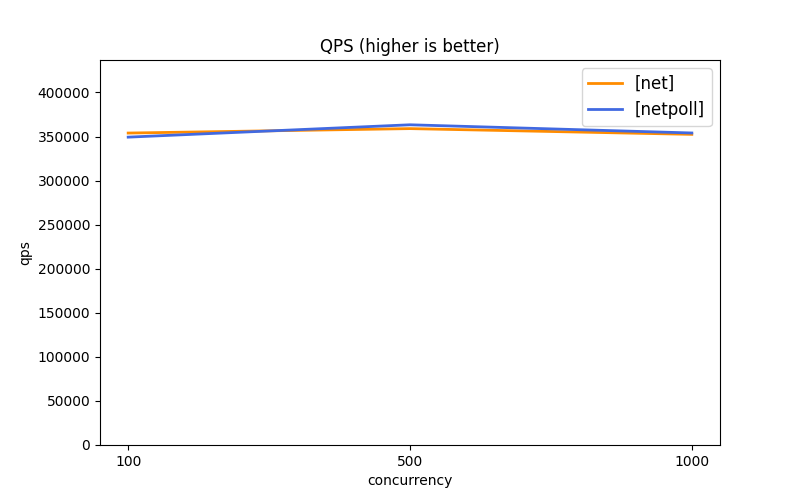 | 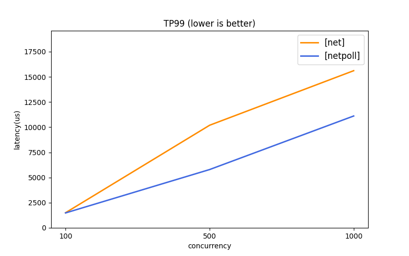 |  |


### [测试场景 3](#测试场景-3)

|             | QPS                                   | TP99                                   | TP999                                   |
| :---------- | :------------------------------------ | :------------------------------------: | :-------------------------------------: |
| Server(4C)  | 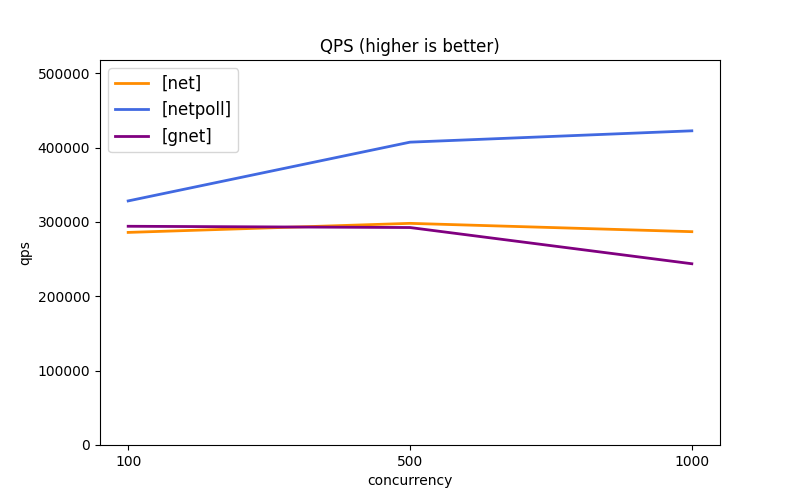 | 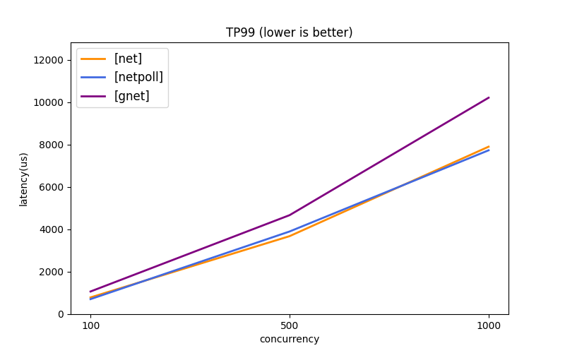 | 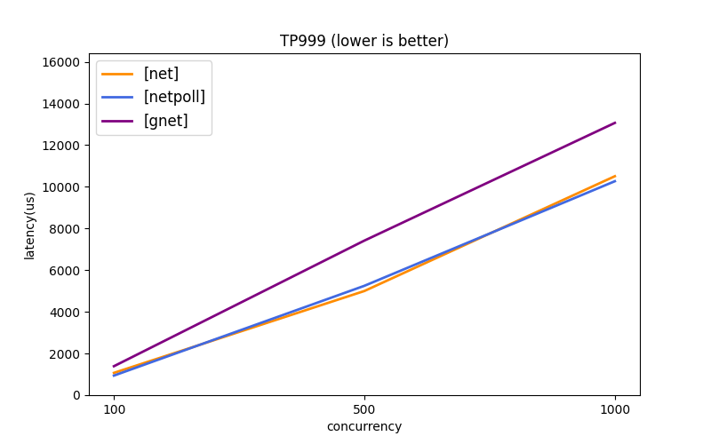 |
| Client(16C) |  | 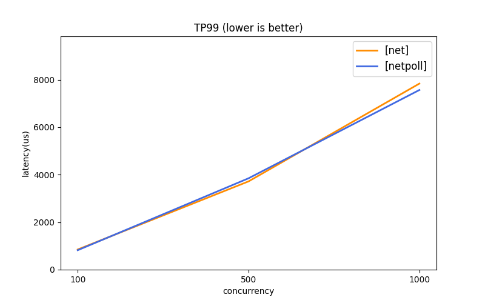 | 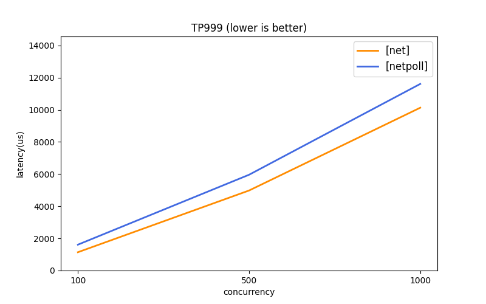 |


[net]: https://github.com/golang/go/tree/master/src/net

[netpoll]: https://github.com/cloudwego/netpoll

[gnet]: https://github.com/panjf2000/gnet

[evio]: https://github.com/tidwall/evio

[redis]: https://redis.io

[nginx]: https://www.nginx.com

[brpc]: https://github.com/apache/incubator-brpc/blob/master/docs/cn/benchmark.md

